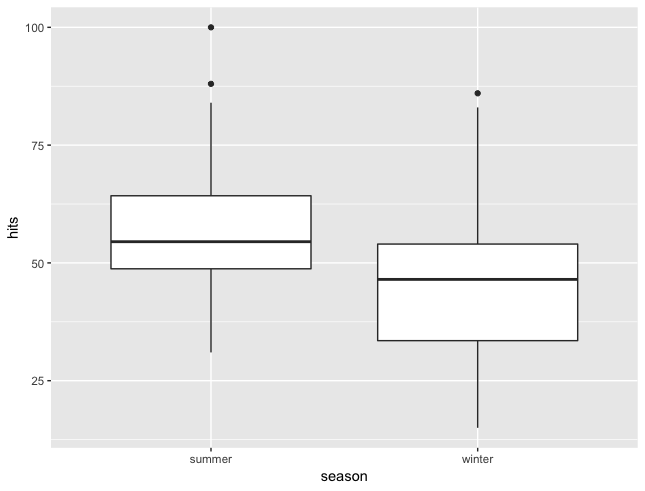

## Introduction    

Prevalence of obesity in industrialized countries has been
continuously rising for more than three decades (Julia et al., 2014). Findings regarding seasonality of BMI and physical activity levels in the general population indicate lower BMI and higher physical activity in summer than in winter.(Kolar et al., 2018). Moreover many researches prove that in the summer months stripping down to a swimsuit increases anxiety in women and men who don’t feel so great about their body (Hadigan, & Walsh, 1991). So, what we're searching for is whether season affects people's desire to try and change their body.

## Hypotheses

Null hypothesis (H0): There is no statistical difference in searching for help on the internet on how to change body image in summer and winter months

Alternative hypothesis (H1): There is statistical difference in searching for help on the internet on how to change body image in summer and winter months

## Methods

To find the information needed for the comparison we will use google trends platform. The search will refer to results found in Greece during years 2015-2018.

Terms: "lose weight"

Independent variable: seasons (summer months, winter months)

Dependent variable: google searches of the term "lose weight"

## Proposed Analysis

Referring to the proposed analysis, we will compare means and more specifically means from independent samples. That's why we will use independent samples t-test. Also, we will use Kolmogorov-Smirnov Test for each variable to test if they are normally distributed, before we compare the means. Lastly, p-value will be set at 5%.

group a = summer
group b = winter

## Results of ks-test

One-sample Kolmogorov-Smirnov test
 
data:  group_a

D = 0.10203, p-value = 0.6512

ks-test = 0.10203, NS

data:  group_b

D = 0.081951, p-value = 0.876

ks-test = 0.081951, NS

In both ks-test analyses we accept the null hypothesis (H0), which suggests that the data follow a normal distribution

## Results of t-test

On average, searches for body image improvement were higher
for group A (M = 57.01923, SD = 16.99) compared 
to group B (M = 44.61538, SD = 13.44)
 
This difference is statistically significant 

  t(101.32) = 4.3439, p = 3.329e-05
  

We reject the null hypothesis (H0) and we accept the alternative hypothesis (H1), which   suggests that there is a significant difference in searching for help on the internet on how to change your body image in summer and in winter
  

## Boxplot

 

## Boxplot results

Independent variable:
Summer= June,July,August
Winter=December,January,February
   
Dependent variable:
Hits= searches of term "lose weight"

As we can see from the boxplot, people search more frequently the term "lose weight" in summer months than in winter months

## Discussion

The results shown us that our hypothesis is confirmed. As we can see there is signifficant difference in searching help on the internet on how to change body image in summer and winter months. Specifically people try to change their body image more often in summer. This may be be true, especially Greece, since in summer greek people start going to the beach, they wear swimsuits and clothes that show parts of their body and having a good body has a positive impact on their self-esteem. 

## Limitations
 
1. Information from more mediteranian countries (e.g Spain,Italy),because they have the same climate and we can understand if truly pleople's need to chage their body image changes by the season. 

2. Google trends is not a reliable source because we don't know the exact number of our population (N), their sex and their age, which are important factors that affect an individual's behaviour about body image. 

3. People may be searching for the term "lose weight" for other purposes other than changing their body. 

4. Future longitudinal and qualitative studies investigating within-subject seasonal changes might be more promising and of higher clinical relevance.

## References
[@julia_weight-loss_2014]
[@hadigan_body_1991]
[@kolar_seasonal_2018]

